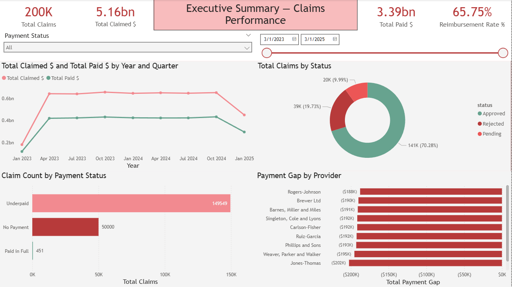

# Healthcare Claims & Revenue Leakage Analytics (SQL + Power BI)

This project analyzes synthetic healthcare claims and payment data using PostgreSQL and Power BI to evaluate reimbursement performance, provider risk, payment timeliness, and revenue leakage.

The analysis connects healthcare revenue-cycle outcomes to the claims process, including submitted claim amounts, payment status, reimbursement gaps, provider performance, and days to payment.

## Dashboard Preview



## Business Questions

- How much revenue is claimed versus actually reimbursed?
- What percentage of claims are underpaid, unpaid, or fully reimbursed?
- Which providers and specialties contribute most to underpayments and revenue leakage?
- How long do payments take after claims are submitted?
- Where do financial and operational risks appear in the claims payment process?

## Business Process

Patient Encounter → Claim Submitted → Claim Status Review → Payment Posted → Reimbursement Gap Analysis → Provider Risk Monitoring

## KPI Framework

| Business Area | Outcome KPI | Driver KPIs / Segments |
|---|---|---|
| Reimbursement Performance | Reimbursement Rate | Total Claimed Amount, Total Paid Amount, Payment Gap |
| Claim Status | Claim Resolution Mix | Approved Claims, Rejected Claims, Pending Claims |
| Revenue Leakage | Underpayment Exposure | Underpaid Claims, No Payment Claims, Payment Status Adjusted |
| Provider Risk | Provider Payment Risk | Provider, Specialty, Underpayment Volume, Rejection Rate |
| Payment Timeliness | Days to Payment | Claim Date, Payment Date, Cleaned Days to Payment |

## Project Workflow

- Created SQL tables for patients, providers, claims, and payments.
- Built reporting views to join claims with payment data and provider details.
- Created derived fields for payment gap, adjusted payment status, reimbursement rate, and days to payment.
- Cleaned payment timing logic by excluding negative or invalid payment lags from timeliness analysis.
- Designed Power BI dashboards to monitor reimbursement performance, provider risk, revenue leakage, and payment timeliness.

## Key Findings

- Total claimed revenue was higher than total paid revenue, creating measurable reimbursement leakage.
- Most claims were approved, but a large share of paid claims remained underpaid.
- Certain providers had higher underpayment exposure and longer payment cycles.
- Revenue leakage persisted across reporting periods even as average days to payment improved over time.
- Provider and specialty segmentation helped identify where reimbursement risk was concentrated.

## Tools Used

- PostgreSQL
- SQL
- Power BI
- DAX
- Data Modeling
- Fact and Dimension Views
- KPI Development
- Revenue Cycle Analysis
- Provider Risk Analysis
- Business Intelligence Reporting

## Repository Structure

```text
data/
sql/
analysis_queries/
screenshots/
README.md
```

## Full Portfolio Walkthrough

A deeper project walkthrough is available in my Notion portfolio, including the business process, KPI framework, dashboard analysis, SQL implementation, reimbursement logic, and revenue leakage recommendations.
